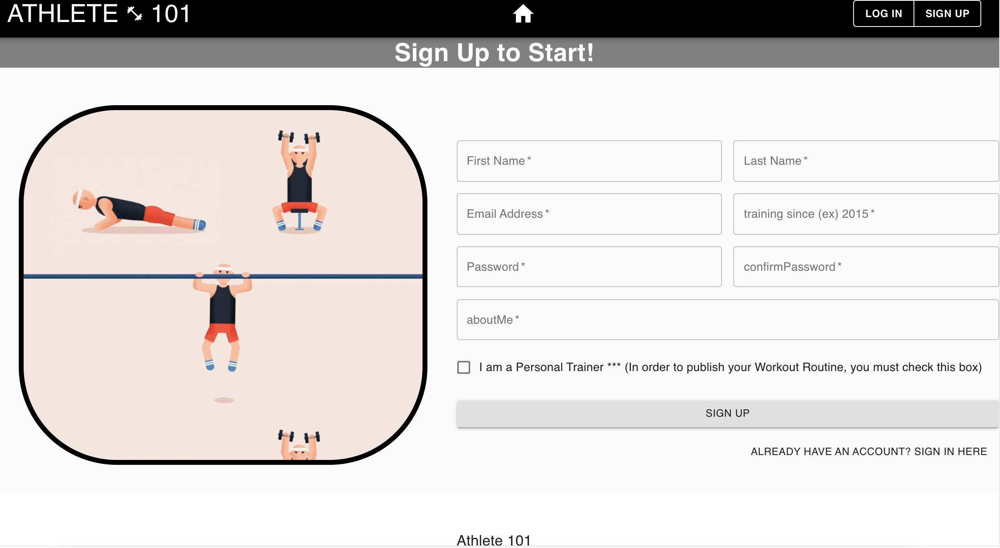
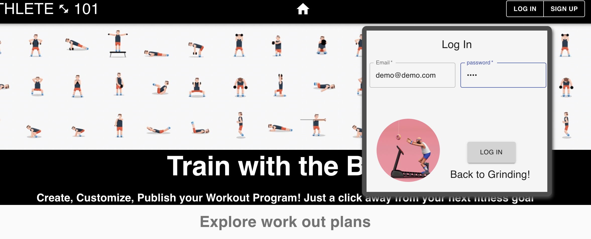
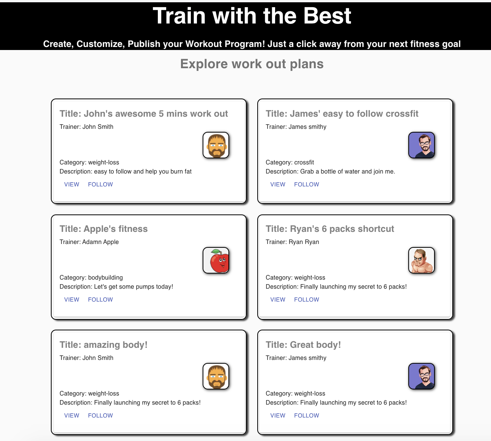
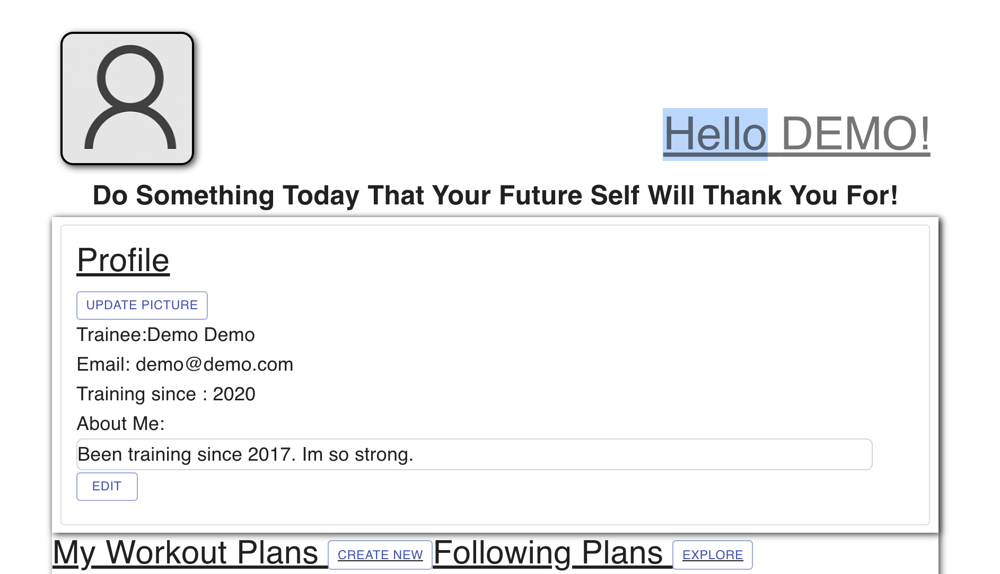
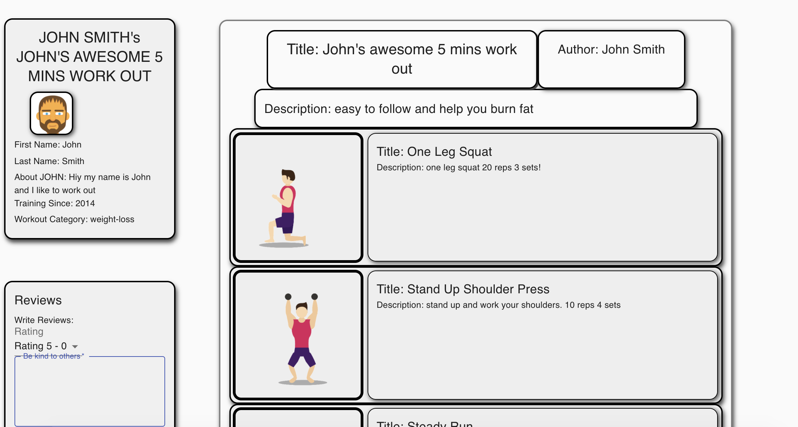
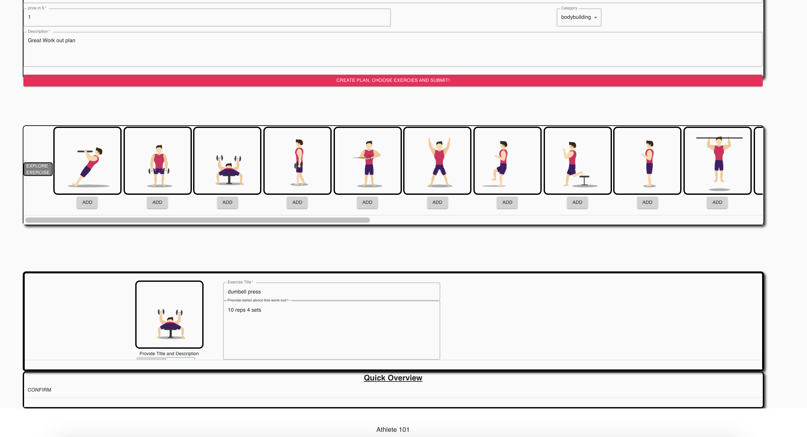

[![LinkedIn][linkedin-shield]][linkedin-url]
<br>
[Live Site](https://master.d1lhvu2lrkgkyh.amplifyapp.com/)

<!-- PROJECT LOGO -->
<br />
<p align="center">
    <a href="https://master.d1lhvu2lrkgkyh.amplifyapp.com/">
    
  </a>
<a href="https://master.d1lhvu2lrkgkyh.amplifyapp.com/">
  <h3 align="center">ATHLETE 101</h3>
 </a>

</p>


<!-- TABLE OF CONTENTS -->
<details open="open">
  <summary><h2 style="display: inline-block">Table of Contents</h2></summary>
  <ol>
    <li>
      <a href="#about-the-project">About The Project</a>
      <ul>
        <li><a href="#technical-stack">Technical Stack</a></li>
        <li><a href="#introduction">Introduction</a></li>
        <li><a href="#mvp">MVP</a></li>
      </ul>
    </li>
    <li>
      <a href="#getting-started">Getting Started</a>
      <ul>
        <li><a href="#prerequisites">Prerequisites</a></li>
        <li><a href="#installation">Installation</a></li>
      </ul>
    </li>
    <li><a href="#usage">Usage</a></li>
    <li><a href="#api-frontend">API Frontend</a></li>
    <li><a href="#api-backend">API Backend</a></li>
    <li><a href="#redux-state-structure">Redux State Structure</a></li>
  </ol>
</details>


<!-- ABOUT THE PROJECT -->
## About The Project
*Easy sign up page.

*Login options with demo login

*Renders all the workout plans.

*My profile page with my workout plans and following workout plans.

*View work out plan.

*Can create workout plan.


### Technical Stack

* The project runs a React/Redux frontend.
* Material-UI
* The Backend uses Express and S3 with postgreSQL.


### introduction


  Athlete101 is a online platform that allows users to create workout plans. User can simply create workout with given exercises and follow others. In My101, users can manage their plans and following plans.


### MVP
the MVP for this website encompasses the following:

1.  Login/Sign-up
    1. Users can login as a demo account.
    2. Users can create account in sign-up page.
2.  Main Browser
    1. Show all the plans users created including others users.
    2. each card shows users's name, avator, and short description.
    3. users can click view detail.
    4. users can follow workout plans
3. Plan
    1. Show the detail of the plan along with associating exercises.
    2. Can create and delete workout plans that belowing to the user.
    3. Can floow other user's workout plan and navigate to that from my profile.
4. Review
    1. Can submit review with rating.


<!-- GETTING STARTED -->
## Getting Started
-----------

To get a local copy up and running follow these simple steps.

### Prerequisites

Express, react, s3...

### Installation


1. Clone the repo
   ```sh
   git clone https://github.com/southpeter77/athlete-101
   git clone https://github.com/southpeter77/backEnd101
   ```
2. Install NPM packages
   ```sh
   npm install
   ```
3. Create your postgres database and connect it to the app.

4. run backend at the root level
   ```sh
   npm start
   ```
5. cd into Client directory to run frontend
   ```sh
   npm start
   ```
6. browser will open automatically.


<!-- USAGE EXAMPLES -->
## Usage
-----------

One User can have an amazing workout plan that should be shared with others. Using this platform, anyone can join and create their own workout plan, follow other's and review each others. 

## API Frontend
--------------------------
|Path|HTTP Verb|Meaning|
|-|-|-|
|/|GET|Login|
|/signup|GET|Sign up page|
|/plan/:id|GET|Show all the exercise belong to this plan|
|/myProfile|GET|Show my profile|
|/myProfile/createPlan|GET|Create workout Plans|


--------------------------

## API Backend
-----------
|Path|HTTP Verb|Meaning|
|-|-|-|
|/api/user/|PUT|Log In|
|/api/user/:id|GET|Get information of this User|
|/api/user/signup|POST|Create User's account and sign in|
|/api/review/|PUT|Get reviews for certain Plan|
|/api/review/submit|POST|Create review for the plan|
|/api/profile/aboutme|PUT|Get information about me|
|/api/plan/:id|GET|Get information about the Plan|
|/api/plan/create|POST|Create Plan|
|/api/plan/delete|DELETE|Delete Plan|
|/api/plan/top|GET|Get top Plans|
|/api/plan/myplan|GET|Get my Plans|
|/api/images/all|GET|Get all the images|
|/api/images/upload|PUT|Upload images|
|/api/exercise/all|GET|get all the exercises|
|/api/exercise/create|POST|Create an exercise|
|/api/exercise/delete|DELETE|Delete an exercise|

## Redux State Structure
```
state={
    user,
    plan,
    profile,
    category,
    exercise,
    exerciseFormDetail,
    review,
    following,
    images  
}


```


[linkedin-shield]: https://img.shields.io/badge/-LinkedIn-black.svg?style=for-the-badge&logo=linkedin&colorB=555
[linkedin-url]: https://www.linkedin.com/in/peter-kang-129184166/
